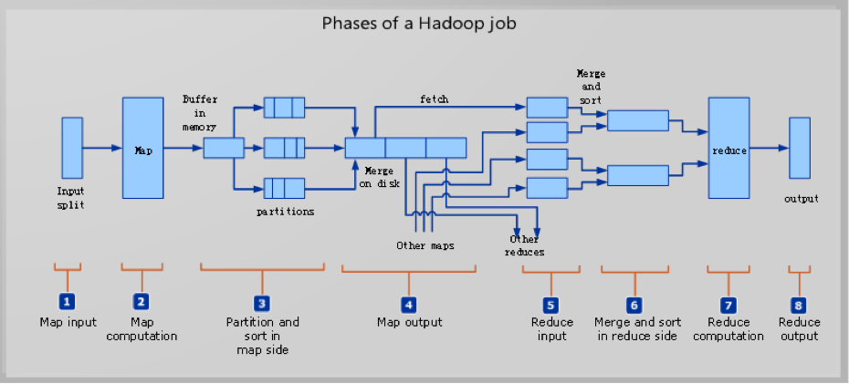

# Hadoop Fundamental

## HDFS

Block size 设置大点减小seek time

Namenodes 不持久化保存 block 位置，在启动的时候从datanode获取

Namenode 单点问题
- namenode 异步原子写状态到本地或远程存储上
- secondary namenode

Block cache
- Managed by namenode
- Configurable on a per-file basis

Namenode federation
- Multi namespace multi namenodes

HDFS HA
- NFS filer
- QJM

Failover and fencing
- failover controller (default zookeeper)
- fencing QJM only allow one namenode to write to the edit log at one time
- client dns map

Read/Write

## YARN

- ResourceManager
- ApplicationMaster
- Resource Model
    - Resource name
    - Amount of memory
    - CPUs
    - Eventually resources such as disk/network I/O, GPUs, and more

## Hadoop I/O

### Data Integrity
CRC-32 循环检测

### Compression
Native lib
CodecPool

### Serialization
Writable Interface

## MapReduce
- MRUnit
- Web UI
- Debug (Remote)
- Log
- Tuning a Job, Profile
- Workflow

How work
- Job Submission
- Job initialization
- Ubertask for small application
- Task assignment
- Task execution
- Progress and Status Updates

FileInputFormat
splits max(minimumSize, min(maximumsize, blockSize)
small files CombineFileInputFormat

日志收集系统
